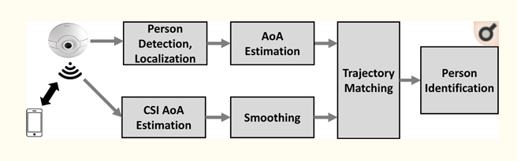

# Lab06 - Artigo de Dataset Público

# Aluno
* `237833`: `João Vitor Baptista Moreira`

# Análise do Artigo `EyeFi: Fast Human Identification Through Vision and WiFi-based Trajectory Matching`

| campo | valor |
|------------|----------------------------------------|
| referência | ` Shiwei Fang; Tamzeed Islam; Sirajum Munir; Shahriar Nirjon` |
| link       | [Artigo](https://www.ncbi.nlm.nih.gov/pmc/articles/PMC7837618/) |
| dataset | [Dataset](https://zenodo.org/record/3882104#.YU6epaBv9n0) |
| formato | `H5` |

## Resumo

> O artigo tem como objetivo propor um framework de previsão de trajetórias de movimento e detecção de pessoas por meio de uma associação de uma câmera de vigilância com um chip WiFi. Esse modelo, que foi chamado de EyeFi, utiliza a rede WiFi para calcular o ângulo de chegada dos pacotes de dados emitidos pelo celular do indivíduo ao procurar uma conexão por perto. Dessa maneira, as informações coletadas pelo WiFi podem suavizar os dados observados pela câmera de vigilância, uma vez que ela possui pontos cegos que diminuem a precisão do modelo. Assim, combinando as duas técnicas, o framework EyeFi consegue identificar com maior precisão uma pessoa e seus movimentos. Um esquema de alto nível do funcionamento do EyeFi está mostrado na [Figura 1](images/figura1.png).

## Perguntas de pesquisa/análises

> Com esse dataset, é possível realizar análises sobre se é possível identificar pessoas de maneira precisa a partir da captura de trajetórias de movimento desses indivíduos. Além disso, podemos refletir sobre os melhores meios de se identificar pessoas sem causar danos à ética envolvida no desenvolvimento de uma inteligência artificial.

## Trabalhos relacionados

> Halperin, Daniel, et al. "Tool release: Gathering 802.11 n traces with channel state information." ACM SIGCOMM Computer Communication Review 41.1 (2011): 53-53.

> Kotaru, Manikanta, et al. "Spotfi: Decimeter level localization using wifi." Proceedings of the 2015 ACM Conference on Special Interest Group on Data Communication. 2015.

> Zhang, Dongheng, et al. "Calibrating Phase Offsets for Commodity WiFi." IEEE Systems Journal (2019).
