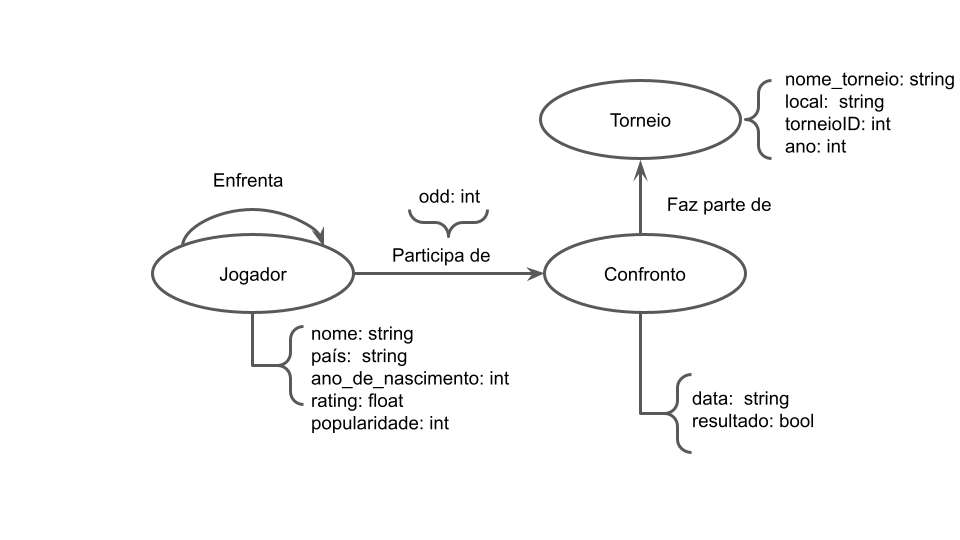

# Lab07 - Modelo Lógico para Banco de Dados de Grafos

# Aluno
* `237833`: `João Vitor Baptista Moreira`

## Modelo Lógico do Banco de Dados de Grafos

> 

## Perguntas de Pesquisa/análise

> Liste aqui as três perguntas de pesquisa/análise
> * Como a idade de um jogador afeta sua chance de avançar no torneio?
> * Como as apostas favoráveis a um jogador influenciam no resultado da partida?
> * Qual a relação entre a popularidade do jogador e as apostas favoráveis a ele?
